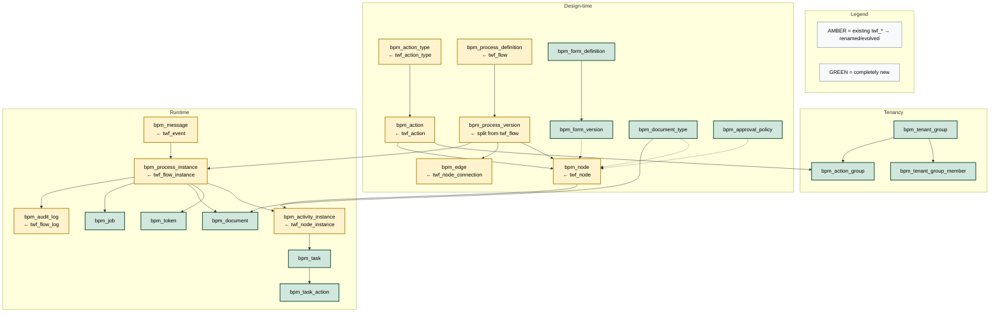
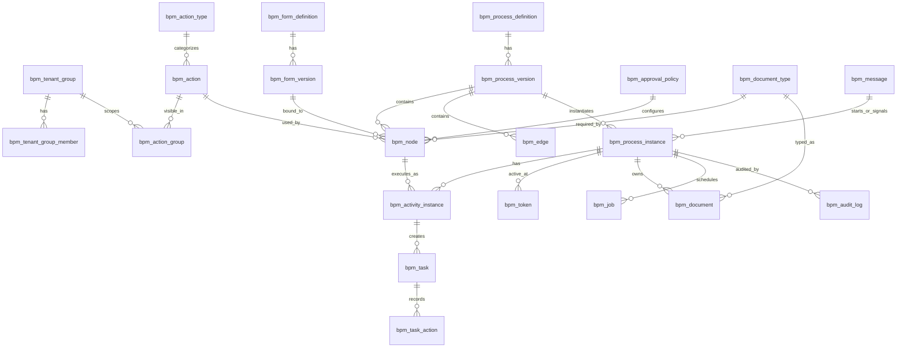

# BPM + Automation Platform — Design Proposal

**Status:** Draft  
**Base:** Current Tempo Flows (`twf_*`, `EventHq`, SQS worker) — see [FLOWS.md](./FLOWS.md)  
**Stack lean (v1):** NestJS + React + PostgreSQL + SQS/BullMQ

---

## 1. Summary — what we want to build

We want a **new process platform** that keeps everything that already works in Tempo Flows (visual automation, action catalog, event + queue, multi-tenant templates) and extends it into a real **BPM** product.

**In short:**

| Today (Flows) | Tomorrow (BPM + Automation) |
|---------------|-----------------------------|
| Event → delay → email/push/controller | Same automations, cleaner engine |
| Mostly linear graphs | Gateways (branch / parallel) with clear UI |
| Little human workflow | Forms, approvals, assignees, task inbox |
| No first-class documents | Require / upload / generate documents |
| Internal controllers mainly | HTTP / webhooks / external connectors |
| Soft versioning | Immutable process versions |
| Magic vendor `55` | Explicit **SYSTEM / GROUP / TENANT** catalog scopes |

**Product shape (same engine, two modes):**

1. **Automation** — fire-and-forget graphs (billing alerts, COS push, funnels).  
2. **BPM** — long-running cases (form → approve → documents → notify → close).

**Builder UX (keep):** left = action palette · center = canvas · right = node form (`schema_json`).

**Migration:** strangler pattern — keep `twf_*` running; migrate process-by-process (e.g. Safe Families first); do not big-bang rewrite.

---

## 2. ER diagram (color legend)

| Color | Meaning |
|-------|---------|
| **Amber** | Exists today as `twf_*` → **renamed / evolved** |
| **Green** | **Completely new** (no direct `twf_*` equivalent) |





**Color checklist**

| Amber — renamed / evolved | Green — new |
|---------------------------|-------------|
| `bpm_action_type` ← `twf_action_type` | `bpm_tenant_group` |
| `bpm_action` ← `twf_action` | `bpm_tenant_group_member` |
| `bpm_process_definition` ← `twf_flow` | `bpm_action_group` |
| `bpm_process_version` ← split from `twf_flow` | `bpm_form_definition` / `bpm_form_version` |
| `bpm_node` ← `twf_node` | `bpm_document_type` |
| `bpm_edge` ← `twf_node_connection` | `bpm_approval_policy` |
| `bpm_process_instance` ← `twf_flow_instance` | `bpm_token` |
| `bpm_activity_instance` ← `twf_node_instance` | `bpm_task` / `bpm_task_action` |
| `bpm_message` ← `twf_event` | `bpm_document` |
| `bpm_audit_log` ← `twf_flow_log` | `bpm_job` |

> Tenant identity maps to today’s `vendor_id`. Optional bridge tables `twf_origin_name` / `twf_field_map` can remain for legacy view-based automations; BPM case data lives in `bpm_process_instance.variables`.

---

## 3. Data dictionary

Conventions used below:

- `tenant_id` = vendor id (unless noted).  
- JSON examples are illustrative.  
- `visibility_scope`: `SYSTEM` | `GROUP` | `TENANT`.

---

### 3.1 Tenancy

#### `bpm_tenant_group` *(new)*

Groups of tenants that share a catalog slice (e.g. business type).

| Column | Type | Description | Example |
|--------|------|-------------|---------|
| `id` | PK | Group id | `1` |
| `code` | varchar | Stable code | `SF` |
| `name` | varchar | Display name | `Safe Families` |
| `is_active` | bool | Soft enable | `true` |

#### `bpm_tenant_group_member` *(new)*

| Column | Type | Description | Example |
|--------|------|-------------|---------|
| `id` | PK | Row id | `10` |
| `tenant_id` | int | Vendor id | `674` |
| `tenant_group_id` | FK | Group | `1` (`SF`) |

#### `bpm_action_group` *(new)*

Links a GROUP-scoped action to one or more tenant groups.

| Column | Type | Description | Example |
|--------|------|-------------|---------|
| `action_id` | FK | Action | `111` |
| `tenant_group_id` | FK | Group that may use it | `1` (`SF`) |

---

### 3.2 Catalog (palette)

#### `bpm_action_type` *(← `twf_action_type`)*

Category in the left palette (Delay, Email, Controller, HTTP, Approval, …).

| Column | Type | Description | Example |
|--------|------|-------------|---------|
| `id` | PK | Type id | `28` |
| `code` | varchar | Stable type code | `CONTROLLER_EXECUTION` |
| `name` | varchar | Palette group label | `CONTROLLER EXECUTION` |
| `schema_json` | json | Shared UI schema for the type | `{ "timeout": { ... } }` |
| `is_start` | char(1) | Can be a start/trigger type | `N` |
| `is_delay` | char(1) | Timer-like behavior | `N` |
| `on_duplicate` | varchar | Hook when process is cloned | `duplicateEmailTemplate` |
| `is_active` | bool | Visible in palette | `true` |

#### `bpm_action` *(← `twf_action`)*

Reusable step/event definition (stable contract via `code`).

| Column | Type | Description | Example |
|--------|------|-------------|---------|
| `id` | PK | Action id | `111` |
| `action_type_id` | FK | Category | `28` |
| `code` | varchar | **Stable API key** (never hardcode numeric id in callers) | `SF SEND COS PUSH` |
| `name` | varchar | Builder label | `Send Push Notification to COS members` |
| `description` | text | Help text in palette | `Sends a push when a COS message is posted` |
| `schema_json` | json | Right-panel form for this action | `{ "subject": {...}, "message": {...} }` |
| `config_json_template` | json | Defaults / `{{ FIELD }}` placeholders | `{ "subject": "{{ FAMILY_NAME }}" }` |
| `controller_function` | varchar | Internal handler or connector key | `hq-nd/BusinessTypeSF/sendCircleOfSupportNotification` |
| `visibility_scope` | varchar | Who can use it | `GROUP` |
| `owner_tenant_id` | int null | Set when scope = `TENANT` | `null` |
| `is_enabled` | bool | Kill switch | `true` |
| `icon` | varchar | Palette icon | `mdi:bell-ring-outline` |

---

### 3.3 Process definition (design-time graph)

#### `bpm_process_definition` *(← `twf_flow` metadata)*

Logical process (many versions).

| Column | Type | Description | Example |
|--------|------|-------------|---------|
| `id` | PK | Definition id | `100` |
| `key` | varchar | Stable process key | `sf-new-cos-message` |
| `name` | varchar | Display name | `New COS Message` |
| `category` | varchar | `automation` or `bpm` | `automation` |
| `owner_tenant_id` | int null | Owning vendor; null for platform template | `674` |
| `visibility_scope` | varchar | Who may clone/subscribe | `GROUP` |
| `icon` | varchar | UI icon | `chatbubbles-outline` |
| `is_active` | bool | Soft delete | `true` |

#### `bpm_process_version` *(split from `twf_flow`)*

Immutable published graph. Running instances pin a version.

| Column | Type | Description | Example |
|--------|------|-------------|---------|
| `id` | PK | Version id | `45` |
| `definition_id` | FK | Parent definition | `100` |
| `version` | int | Monotonic version number | `3` |
| `status` | varchar | `draft` \| `published` \| `retired` | `published` |
| `published_at` | timestamp null | Publish time | `2026-07-15T12:00:00Z` |
| `graph_checksum` | varchar | Optional integrity hash | `sha256:…` |

#### `bpm_node` *(← `twf_node`)*

One element on the canvas.

| Column | Type | Description | Example |
|--------|------|-------------|---------|
| `id` | PK | Node id | `18200` |
| `version_id` | FK | Process version | `45` |
| `action_id` | FK null | Catalog action (null for pure gateways/start/end) | `111` |
| `element_type` | varchar | BPMN-ish type | `serviceTask` / `userTask` / `exclusiveGateway` / `startEvent` |
| `name` | varchar | Label on canvas | `Send Push Notification to COS members` |
| `is_init` | bool | Entry / trigger node | `false` |
| `config_json` | json | Values from right-panel form (`action_config_json` today) | `{ "subject": "{{ REGISTERED_BY_NAME }}", "message": "{{ MESSAGE }}" }` |
| `form_version_id` | FK null | Bound form (user tasks) | `12` |
| `approval_policy_id` | FK null | Approval rules | `3` |
| `document_type_id` | FK null | Required doc type | `null` |
| `position_x` / `position_y` | int | Canvas coordinates | `120`, `340` |

#### `bpm_edge` *(← `twf_node_connection`)*

Directed connection; may carry a condition (gateway branch).

| Column | Type | Description | Example |
|--------|------|-------------|---------|
| `id` | PK | Edge id | `900` |
| `version_id` | FK | Process version | `45` |
| `from_node_id` | FK null | Source; null = link into start | `18199` |
| `to_node_id` | FK | Target | `18200` |
| `name` | varchar null | Branch label | `approved` |
| `condition_expr` | varchar null | Expression for XOR/default | `variables.decision == "approved"` |
| `is_default` | bool | Default flow on gateway | `false` |

---

### 3.4 Forms, approvals, documents (design-time)

#### `bpm_form_definition` *(new)*

| Column | Type | Description | Example |
|--------|------|-------------|---------|
| `id` | PK | Form id | `5` |
| `key` | varchar | Stable key | `sf-need-review` |
| `name` | varchar | Display name | `Need review form` |
| `visibility_scope` | varchar | Catalog scope | `GROUP` |
| `owner_tenant_id` | int null | If `TENANT` | `null` |

#### `bpm_form_version` *(new)*

| Column | Type | Description | Example |
|--------|------|-------------|---------|
| `id` | PK | Form version id | `12` |
| `form_id` | FK | Parent form | `5` |
| `version` | int | Version number | `2` |
| `schema_json` | json | JSON Schema of fields | `{ "type":"object", "properties": { "notes": { "type":"string" } } }` |
| `ui_schema` | json | UI layout hints | `{ "notes": { "ui:widget":"textarea" } }` |
| `status` | varchar | `draft` \| `published` | `published` |

#### `bpm_approval_policy` *(new)*

| Column | Type | Description | Example |
|--------|------|-------------|---------|
| `id` | PK | Policy id | `3` |
| `code` | varchar | Stable code | `SF_AREA_ANY` |
| `policy_type` | varchar | `ANY` \| `ALL` \| `N_OF_M` | `ANY` |
| `quorum_n` | int null | Required when `N_OF_M` | `null` |
| `assignee_resolver` | json | How to resolve approvers | `{ "type":"expression", "resolver":"sfAreaApprovers", "args": { "familyAreaId": "{{ variables.familyAreaId }}" } }` |
| `outcomes` | json | Allowed outcomes | `["approved","rejected","changes_requested"]` |

#### `bpm_document_type` *(new)*

| Column | Type | Description | Example |
|--------|------|-------------|---------|
| `id` | PK | Doc type id | `7` |
| `code` | varchar | Stable code | `HOST_AGREEMENT` |
| `name` | varchar | Label | `Host agreement PDF` |
| `mime_allowlist` | json | Allowed MIME types | `["application/pdf"]` |
| `max_size_mb` | int | Upload limit | `10` |
| `visibility_scope` | varchar | Catalog scope | `GROUP` |

---

### 3.5 Runtime

#### `bpm_process_instance` *(← `twf_flow_instance`)*

One running (or completed) case.

| Column | Type | Description | Example |
|--------|------|-------------|---------|
| `id` | PK | Instance id | `5001` |
| `version_id` | FK | Pinned process version | `45` |
| `tenant_id` | int | Owning vendor | `674` |
| `business_key` | varchar | External correlation id | `cos-message:8891` |
| `status` | varchar | `running` \| `waiting` \| `completed` \| `failed` \| `cancelled` | `running` |
| `variables` | json | Case data (replaces heavy reliance on SQL views) | `{ "referralId": 321, "familyName": "The Smith Family", "familyInitials": "SM", "message": "Can someone cover Friday?" }` |
| `started_at` / `ended_at` | timestamp | Lifecycle | `2026-07-16T14:01:00Z` / `null` |

#### `bpm_activity_instance` *(← `twf_node_instance`)*

One execution of a node inside an instance.

| Column | Type | Description | Example |
|--------|------|-------------|---------|
| `id` | PK | Activity id | `80001` |
| `instance_id` | FK | Process instance | `5001` |
| `node_id` | FK | Definition node | `18200` |
| `status` | varchar | `pending` \| `active` \| `completed` \| `failed` \| `skipped` | `completed` |
| `input_json` | json | Snapshot of inputs | `{ "subject": "Jane Doe", "message": "…" }` |
| `output_json` | json | Snapshot of outputs | `{ "sent": 3, "skipped": 1 }` |
| `error_message` | text null | Failure detail | `null` |
| `started_at` / `completed_at` | timestamp | Timing | … |

#### `bpm_token` *(new)*

Active position(s) in the graph (required for parallel gateways).

| Column | Type | Description | Example |
|--------|------|-------------|---------|
| `id` | PK | Token id | `60` |
| `instance_id` | FK | Process instance | `5001` |
| `node_id` | FK | Current node | `18200` |
| `status` | varchar | `active` \| `consumed` | `active` |
| `parent_token_id` | FK null | For parallel forks | `null` |

#### `bpm_task` *(new)*

Human inbox item (form / approval).

| Column | Type | Description | Example |
|--------|------|-------------|---------|
| `id` | PK | Task id | `900` |
| `activity_id` | FK | Related activity | `80010` |
| `instance_id` | FK | Process instance (denormalized for queries) | `5001` |
| `tenant_id` | int | Tenant | `674` |
| `task_type` | varchar | `FORM` \| `APPROVAL` | `APPROVAL` |
| `title` | varchar | Inbox title | `Approve posted need #441` |
| `assignee` | varchar null | Claimed user id/email | `approver@sf.org` |
| `candidate_users` | json | Potential assignees | `["a@sf.org","b@sf.org"]` |
| `candidate_groups` | json | Role/group keys | `["SF_AREA_12"]` |
| `due_at` | timestamp null | SLA due | `2026-07-17T18:00:00Z` |
| `status` | varchar | `open` \| `completed` \| `cancelled` | `open` |
| `form_version_id` | FK null | Form to render | `12` |
| `payload_json` | json | Task-specific data | `{ "needId": 441, "kind": "post" }` |

#### `bpm_task_action` *(new)*

Audit of human actions on a task.

| Column | Type | Description | Example |
|--------|------|-------------|---------|
| `id` | PK | Action id | `1200` |
| `task_id` | FK | Task | `900` |
| `actor` | varchar | Who acted | `a@sf.org` |
| `action` | varchar | `approve` \| `reject` \| `comment` \| `reassign` \| `complete` | `approve` |
| `comment` | text null | Optional note | `Looks good` |
| `data_json` | json null | Submitted form fields | `{ "notes": "OK" }` |
| `created_at` | timestamp | When | `2026-07-16T15:00:00Z` |

#### `bpm_document` *(new)*

Uploaded or generated file for an instance.

| Column | Type | Description | Example |
|--------|------|-------------|---------|
| `id` | PK | Document id | `70` |
| `instance_id` | FK | Process instance | `5001` |
| `document_type_id` | FK | Type | `7` |
| `tenant_id` | int | Tenant | `674` |
| `file_name` | varchar | Original name | `host-agreement.pdf` |
| `s3_key` | varchar | Storage key | `bpm/674/5001/host-agreement.pdf` |
| `mime_type` | varchar | MIME | `application/pdf` |
| `status` | varchar | `required` \| `uploaded` \| `approved` \| `rejected` | `uploaded` |
| `uploaded_by` | varchar null | Actor | `coach@sf.org` |

#### `bpm_message` *(← `twf_event`)*

Inbound event / signal that starts or resumes a process.

| Column | Type | Description | Example |
|--------|------|-------------|---------|
| `id` | PK | Message id | `56953` |
| `action_code` | varchar | Trigger action code (or process key) | `SF NEW COS MESSAGE` |
| `tenant_id` | int null | Known tenant if resolved | `674` |
| `business_key` | varchar null | Correlation | `cos-message:8891` |
| `payload_json` | json | Event body / origin row snapshot | `{ "id": 8891, "referralId": 321, "familyName": "The Smith Family", "familyInitials": "SM" }` |
| `desc_job_name` | varchar | Caller context (like today) | `CircleOfSupport/createMessage` |
| `status` | varchar | `pending` \| `processed` \| `failed` | `processed` |
| `process_instance_id` | FK null | Instance created/signaled | `5001` |

#### `bpm_job` *(new)*

Async work: timers, HTTP retries, delayed continuations (worker queue rows).

| Column | Type | Description | Example |
|--------|------|-------------|---------|
| `id` | PK | Job id | `300` |
| `instance_id` | FK null | Related instance | `5001` |
| `activity_id` | FK null | Related activity | `80001` |
| `job_type` | varchar | `TIMER` \| `HTTP` \| `EMAIL` \| `PUSH` \| `CONTINUE` | `PUSH` |
| `run_at` | timestamp | When eligible | `2026-07-16T14:01:05Z` |
| `attempts` | int | Retry count | `1` |
| `max_attempts` | int | Cap | `4` |
| `payload_json` | json | Worker payload | `{ "actionCode": "SF SEND COS PUSH", "config": { ... } }` |
| `status` | varchar | `scheduled` \| `running` \| `done` \| `failed` | `done` |
| `last_error` | text null | Last failure | `null` |

#### `bpm_audit_log` *(← `twf_flow_log`)*

Immutable trail for support and compliance.

| Column | Type | Description | Example |
|--------|------|-------------|---------|
| `id` | PK | Log id | `10001` |
| `instance_id` | FK null | Process instance | `5001` |
| `tenant_id` | int null | Tenant | `674` |
| `event_type` | varchar | `INSTANCE_STARTED` \| `TASK_COMPLETED` \| `NODE_FAILED` \| … | `NODE_FAILED` |
| `message` | text | Human-readable summary | `Push connector timeout` |
| `details_json` | json | Structured detail / stack excerpt | `{ "activityId": 80001, "error": "ETIMEDOUT" }` |
| `created_at` | timestamp | When | `2026-07-16T14:02:00Z` |

---

## 4. Multi-tenancy (catalog visibility) — short

| Scope | Who sees the action/form/template |
|-------|-----------------------------------|
| `SYSTEM` | All tenants |
| `GROUP` | Tenants in linked `bpm_tenant_group` (via `bpm_action_group`) |
| `TENANT` | Only `owner_tenant_id` |

Builder palette = `SYSTEM ∪ GROUP(member) ∪ TENANT(owner)`.  
**Always re-validate on publish and execute** (never trust UI alone).  
Instance/task/document data is always hard-scoped by `tenant_id`.

Replace today’s “vendor 55 runs for everyone” with **platform/group templates + tenant clone or subscription**.

---

## Appendix A — Keep / improve from current Flows

**Keep:** stable action `code`, action catalog + `schema_json`, node graph, event + SQS worker, template duplicate, instance history, 3-pane builder.

**Improve:** human tasks, approvals, forms, documents, gateway UX, case variables, HTTP connectors, immutable versions, observability.

Details of the current engine: [FLOWS.md](./FLOWS.md).

---

## Appendix B — Target capabilities (MVP → later)

| Capability | Approach |
|------------|----------|
| Forms | `bpm_form_*` + User Task node |
| Approvals | `bpm_approval_policy` + `bpm_task` |
| Branching | `exclusiveGateway` / `parallelGateway` + `bpm_edge.condition_expr` + `bpm_token` |
| Documents | `bpm_document_type` + `bpm_document` + S3 |
| External APIs | Action types `HTTP_REQUEST`, `WEBHOOK_WAIT`, connectors |
| Automations | Same engine; category=`automation`; service tasks only |

---

## Appendix C — Stack & migration

| Layer | Choice |
|-------|--------|
| API + engine v1 | **NestJS** modular monolith |
| Workers | NestJS + SQS/BullMQ |
| UI | React (evolve Harmony builder + task inbox) |
| DB | PostgreSQL preferred |
| Later | Optional Go workers if metrics demand |

**Migration:** keep `twf_*` live → adapter from `EventHq.add` → migrate SF processes first → retire legacy write path when ready.

---

## Appendix D — Open decisions

1. Expression language: JSONLogic vs CEL vs JMESPath  
2. Form tech: RJSF vs Formily vs custom  
3. Postgres vs MySQL for the new DB  
4. Inbox inside Harmony vs separate app  
5. BPMN XML export in v1 or JSON-only  
6. Tenant groups: reuse `business_type` vs dedicated packs  
7. Global automations: subscription (recommended) vs fan-out listener  

---

## Appendix E — Example process (Safe Families)

```text
Start (SF NEW COS MESSAGE / SF NEW POSTED NEED)
  → Service Task: notify (push)
  → [BPM] User/Approval Task (optional)
  → Exclusive Gateway (approved / rejected)
  → Service Task: decision notification
  → End
```

Same trigger model as today; richer graph when human steps are needed.
