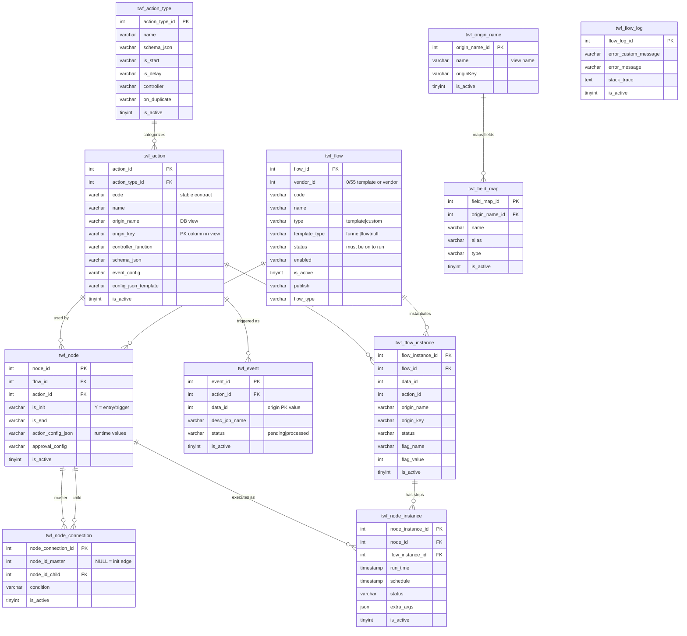
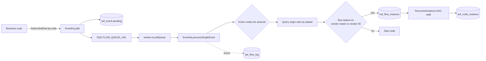

# Tempo Flows (Workflow Engine)

This document describes how automation **flows** work in Tempo: database structure, runtime pipeline, and how to trigger or assemble them.

Flows are a **node-graph automation engine**. Definitions and runtime state live in MySQL tables prefixed `twf_*`. Core entities and graph execution come from **`@pxp-nd/flow`**. Tempo adds business orchestration via `EventHq`, `FlowHQ`, and an SQS worker.

---

## High-level architecture

```text
Business code (controllers / PHP jobs)
        │
        ▼
EventHq.add({ actionId, descJobName, dataId })
        │
        ├─► twf_event (status: pending)
        └─► SQS FIFO (FLOW_QUEUE_URL)
                │
                ▼
        worker.ts  →  EventHq.processSingleEvent({ eventId })
                │
                ├─► Find active twf_node rows for actionId
                ├─► Query origin view (origin_name + origin_key = dataId)
                ├─► Vendor match + event_config conditions
                ├─► Create twf_flow_instance
                └─► NodeInstanceController.RecursiveInstance() walks the DAG
```

### Key Tempo files

| File | Role |
|------|------|
| `src/modules/hq-nd/controllers/EventHq.ts` | Enqueue events to SQS; process a single event into flow instances |
| `src/modules/hq-nd/controllers/Flow.ts` (`FlowHQ`) | Duplicate templates, chained flows, funnel lists/statistics |
| `src/worker.ts` | SQS consumer (started when `INIT_FLOW_WORKER=Y`) |
| `src/config.ts` / `ormconfig.js` | Registers `flow-nd` module and merges flow entities |

Entities such as `Flow`, `Node`, `Action`, `Event`, `FlowInstance`, `NodeInstance` are **not** redefined in Tempo; they come from `@pxp-nd/flow`.

---

## How execution works (summary)

1. **Fire an event**  
   Application code looks up `twf_action` by stable `code`, then calls `EventHq.add` with:
   - `actionId` — PK of the action  
   - `dataId` — PK value in the action’s origin view (`origin_key`)  
   - `descJobName` — caller context for debugging  

2. **Enqueue**  
   `EventHq.add` inserts a `twf_event` (`status = pending`) and sends a message to SQS containing `eventId`.

3. **Worker**  
   `pollQueue()` in `src/worker.ts` receives the message, deletes it from the queue, then calls `processSingleEvent` with retries (1s / 5s / 10s / 20s). Failures after retries go to Slack (`SLACK_TEMPO_ERROR`).

4. **Match flows**  
   For every active `twf_node` with that `action_id`:
   - Load one row: `SELECT * FROM {origin_name} WHERE {origin_key} = {dataId}`
   - Load parent `twf_flow` — must be `is_active = 1` and **`status = 'on'`**
   - Vendor filter: `flow.vendor_id === view.vendor_id` **OR** `flow.vendor_id === 55` (global Qorus flows)
   - Optional `event_config` filters on the action/node

5. **Run the graph**  
   Create `twf_flow_instance`, then walk `twf_node` / `twf_node_connection` via `RecursiveInstance()`. Each step creates `twf_node_instance` rows. Errors are stored in `twf_flow_log`.

---

## Database ER diagram



> Note: Some FK relationships are logical (enforced in application / TypeORM) rather than hard MySQL foreign keys on every column.

---

## Runtime pipeline diagram



---

## Table reference

| Table | Role |
|-------|------|
| `twf_action_type` | Category of step (EVENT, EMAIL, DELAY, PAGE, CHAINED FLOW, CONTROLLER EXECUTION, …) |
| `twf_action` | Reusable action / event definition; stable API via `code` |
| `twf_flow` | Flow definition (template or vendor custom instance) |
| `twf_node` | One step in a flow; points at one action; holds `action_config_json` |
| `twf_node_connection` | Directed edges (DAG). Init connection uses `node_id_master = NULL` |
| `twf_event` | Async event queue row |
| `twf_flow_instance` | One execution of a flow for a given `dataId` |
| `twf_node_instance` | Per-step execution record |
| `twf_origin_name` | Registry of DB views used as event data sources |
| `twf_field_map` | Column aliases for Harmony builder / templating |
| `twf_flow_log` | Execution / processing errors |

### Important `twf_flow` fields

| Field | Meaning |
|-------|---------|
| `type` | `template` (blueprint) or `custom` (vendor instance) |
| `template_type` | `funnel`, `flow`, or null |
| `status` | Must be **`on`** for `EventHq` to execute the flow |
| `vendor_id` | `0` / `55` for global templates; vendor id for instances. **Vendor 55** matches any vendor’s events |
| `code` | Optional stable identifier (e.g. `NEW_EMAIL_LIST`) |

### Important `twf_action` fields

| Field | Meaning |
|-------|---------|
| `code` | Unique string — always resolve with `Action.findOne({ code })` |
| `origin_name` / `origin_key` | View + PK used when resolving `dataId` |
| `schema_json` | UI form for Harmony flow builder |
| `event_config` | Optional filters: `{ "filters": [{ "originField", "nodeField" }] }` |
| `controller_function` | Tempo controller path for CONTROLLER EXECUTION (e.g. `hq-nd/BusinessTypeSF/sendApprovalNotification`) |

### Common `action_type_id` values (active)

| ID | Name | Notes |
|----|------|--------|
| 9 | EVENT | Trigger / listener node |
| 10 | EMAIL NOTIFICATION | Send email |
| 11 | DELAY | Wait step |
| 16 | PAGE | Opt-in / bridge pages |
| 24 | CHAINED FLOW | Invoke another flow |
| 26 | PUSH NOTIFICATION | Mobile push |
| 28 | CONTROLLER EXECUTION | Call a Tempo controller method |

`on_duplicate` on the action type drives post-processing when duplicating a flow (`duplicateEmailTemplate`, `duplicatePageTemplate`, `duplicateChainedFlow`).

---

## JSON configuration layers

1. **`twf_action_type.schema_json`** — shared UI schema for the type  
2. **`twf_action.schema_json`** — per-action UI overrides  
3. **`twf_node.action_config_json`** — **actual values at runtime** for that node  

Examples of `action_config_json`:

| Type | Typical keys |
|------|----------------|
| PAGE | `templateBuilderId`, `emailListId`, `smsListId`, `title` |
| EMAIL | `to`, `subject`, `templateId` |
| DELAY | `quantity`, `type` (`hours` / `minutes` / `days`) |
| CHAINED / EMAIL_JOURNEY | `flowId` |
| CONTROLLER / push (SF) | `subject`, `message`, `mobileActionId`, `notificationType` |

Templates may use `{{ FIELD }}` placeholders resolved from the origin view row (`config_json_template` / node config).

---

## Triggering a flow from TypeScript

```typescript
import { Action, Event } from '@pxp-nd/flow';
import EventHq from './EventHq';

const action = await Action.findOne({ code: 'ADD EMAIL LIST ADDRESS' });
if (action) {
  const eventInstance = new EventHq('hq-nd/EventHq', Event);
  await eventInstance.add({
    actionId: action.actionId,
    descJobName: 'formLegato',           // caller context
    dataId: resInsert.emailListAddrId,   // PK in action.origin_name
  }, manager);
}
```

Rules:

- Prefer **`EventHq.add()`** in Tempo (enqueues SQS). Do not bypass the queue for production event firing.
- Never hardcode `action_id`; always look up by `code`.
- `dataId` must exist in the action’s origin view.
- Flow must be `status = 'on'` and `is_active = 1`.

Events may also be fired from legacy PHP (e.g. billing jobs calling `hq-nd/EventHq/add`).

---

## Assembling / creating flows

### A. Duplicate a template (preferred for vendor instances)

```typescript
const flowHq = new FlowHQ('hq-nd/FlowHQ');
const result = await flowHq.duplicateFlow(
  { flowId: templateFlowId, vendorId, name: 'Bridge Funnel' },
  manager
);
// Activate if needed:
await manager.createQueryBuilder().update('twf_flow')
  .set({ status: 'on' })
  .where('flowId = :flowId', { flowId })
  .execute();
```

Template IDs often come from env:

- `TEMPLATE_BRIDGE_FUNNEL_FLOW_ID` (default `149`)
- `TEMPLATE_QORD_BRIDGE_FUNNEL_FLOW_ID` (default `3419`)

### B. Patch init node after duplicate

```typescript
await manager.createQueryBuilder().update('twf_node')
  .set({ actionConfigJson: JSON.stringify({ emailListId }) })
  .where('flowId = :flowId AND isInit = :isInit', { flowId, isInit: 'Y' })
  .execute();
```

### C. Chained funnel → email journey

Use `FlowHQ.addChainedFlow()` (duplicates child flow, copies `emailListId`, activates).

### D. SQL registration

Typical order:

1. Optional `twf_action_type`
2. `twf_action` (EVENT + step actions) with `WHERE NOT EXISTS (... code ...)`
3. If new origin: `twf_origin_name` + `twf_field_map`
4. Optional full graph: `twf_flow` → init `twf_node` → connections → step nodes
5. Register in `src/modules/hq-nd/database/jaime-scripts.ts` as `JRR-HQ-[STORY]-[SEQ]`

Modern SF-style DML often registers **actions only** and lets the Harmony UI assemble the graph.

---

## Vendor matching (important)

When processing an event, Tempo runs a flow if:

```text
flow.vendorId === viewVendorId  OR  flow.vendorId === 55
```

So:

- A **vendor-specific** flow only runs for that vendor’s data.
- A **vendor 55 (Qorus)** flow runs for **any** vendor that fires the matching event (global notifications).

---

## Environment variables

| Variable | Purpose |
|----------|---------|
| `FLOW_QUEUE_URL` | SQS FIFO queue for async events |
| `INIT_FLOW_WORKER` | `Y` starts `pollQueue()` from `server.ts` |
| `TEMPLATE_BRIDGE_FUNNEL_FLOW_ID` | Default bridge funnel template |
| `TEMPLATE_QORD_BRIDGE_FUNNEL_FLOW_ID` | Qord bridge funnel template |
| `SLACK_TEMPO_ERROR` | Channel for worker failures after retries |

---

## Naming conventions

- Action `code`: UPPER CASE with spaces — e.g. `NEW POSTED NEED`, `BILLING NOT PROCESSED`, `SF SEND COS PUSH`
- Funnel templates: `type = 'template'`, `template_type = 'funnel'`
- Email / automation templates: `type = 'template'`, `template_type = 'flow'` (or null)
- Vendor copies after `duplicateFlow`: `type = 'custom'`

---

## Do / Don’t

**Do**

- Find actions by `code`
- Duplicate templates for vendor flows; keep them `status = 'on'` when they should run
- Register new origins in `twf_origin_name` (+ field maps) before using them in actions
- Use `EventHq.add` so processing goes through SQS

**Don’t**

- Hardcode `action_id`
- Auto-sync `twf_*` schema (`synchronize` stays false)
- Skip SQS for production event firing
- Hand-build full vendor graphs in TypeScript when a template + `duplicateFlow` exists

---

## Controllers that commonly fire events

Examples in Tempo: `Site`, `Vendor`, `Member`, `Package`, `MemberAccounts`, `EmailList`, `PageTemplate`, `Extra`, `CloudFrontFlow`, mobile `Subscriptions`, `helpers/Site.ts`. Legacy Harmony PHP jobs may also call `EventHq/add` (e.g. billing).

---

## Related Cursor rules

Project conventions for flows are also summarized in `.cursorrules` under **Flows (Workflow Engine)**. Keep this document and those rules aligned when changing the event pipeline or `twf_*` contracts.
